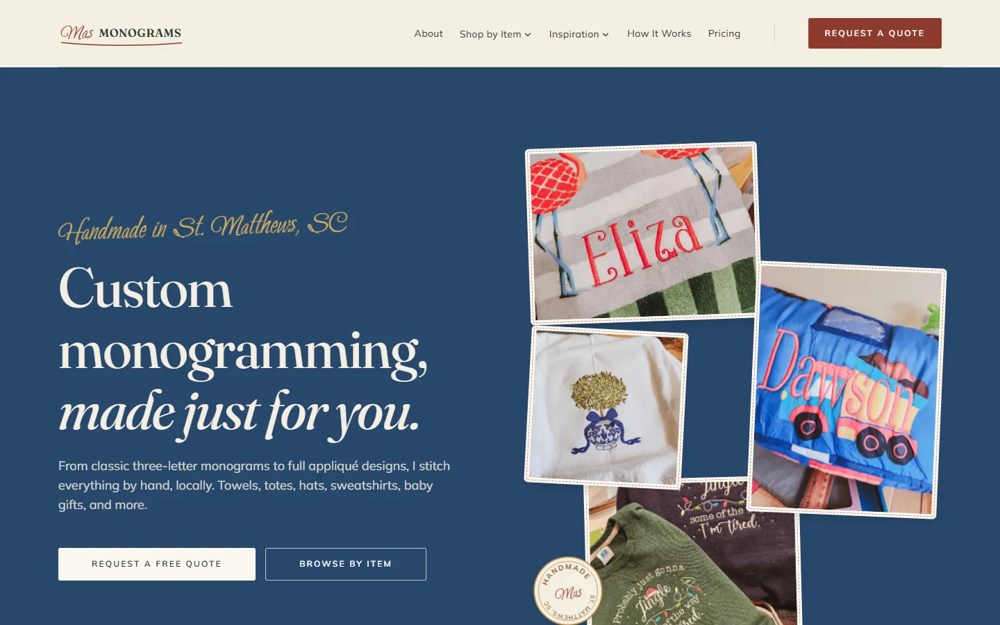
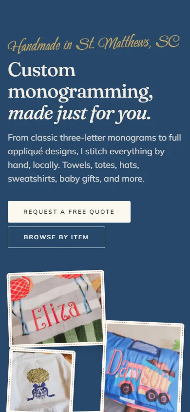
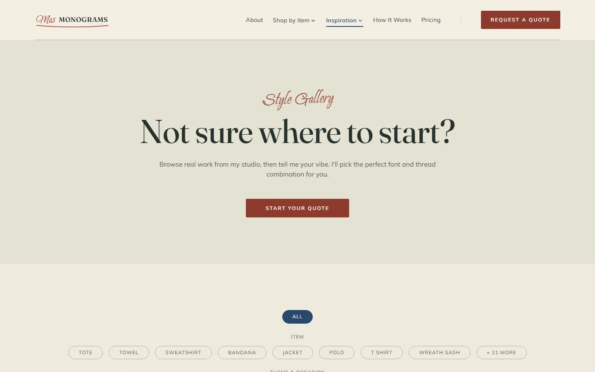
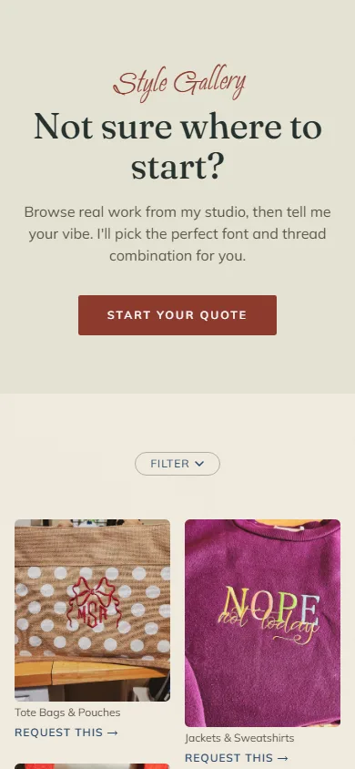

# MAS Monograms

**A custom embroidery shop rebuilt off Squarespace: a quote-first site with a CMS the owner edits in place.**

[](https://github.com/NateJ45/mas-monograms/actions/workflows/ci.yml)
[](https://mas-monograms.com)


<p align="center">
  
  
</p>

## What it is and why

MAS Monograms is Mary Ann Stone's home-based embroidery studio in St. Matthews, South Carolina. Custom embroidery does not fit a shopping cart: price depends on the item, the thread, the placement and the design, so a buy-now button is wrong for almost everything she makes. The old Squarespace site fought that. This rebuild is built around a detailed quote request instead, and around Mary Ann being able to change any word or photo herself without touching code.

**Live:** [mas-monograms.com](https://mas-monograms.com) · **Built by** [Nixon Creative Studio](https://nixoncreativestudio.com)

## Highlights

- **Quote request, not checkout.** A structured quote form captures what is needed to price a job. A small Cloudflare Worker is the only write path: Turnstile bot check, a backup of every submission in R2, and email through Resend. There is no cart. Revenue comes through the quote form and custom invoices, and the Clearance page sells ready-made stock through Stripe Payment Links.
- **The owner edits in context.** Sanity Studio is embedded in the site at `/studio`, so it rebuilds with every deploy and cannot drift out of date. A live draft preview at `/preview/**` gives click-to-edit and in-canvas controls, so changes show on the real page as she makes them.
- **All copy lives in the CMS.** Headings, prose, pricing notes, form labels, galleries and SEO come from Sanity. Nothing visible is hardcoded.
- **A deliberate design direction, "The Sampler".** Warm linen paper, bands drenched in heritage indigo, gold script accents and claret kept for the one action that matters. Expensive through restraint, documented in [`DESIGN.md`](DESIGN.md) and [`PRODUCT.md`](PRODUCT.md).
- **Tested like a product.** Playwright smoke, axe accessibility and reflow suites run on Chromium and a WebKit iPhone profile, alongside Lighthouse, `astro check`, ESLint, prettier and an internal link check. Dependabot keeps dependencies moving.

**Stack:** Astro 7 · Sanity 6 · Cloudflare Workers (R2, Turnstile) · Resend · Stripe Payment Links · Tailwind CSS 4 · React islands · Playwright

<p align="center">
  
  
</p>

---

## Developing

### Stack detail

| Layer      | Tool                                             | Notes                                                                                                      |
| ---------- | ------------------------------------------------ | ---------------------------------------------------------------------------------------------------------- |
| Framework  | **Astro 7**                                      | `output: 'static'` plus a few SSR routes, `@astrojs/cloudflare` adapter, Sharp images. Ships almost no JS. |
| CMS        | **Sanity 6** (Studio embedded at `/studio`)      | Project `xp3elugr`, dataset `production`. All content.                                                     |
| Hosting    | **Cloudflare Workers**                           | Git-connected auto-deploy via Workers Builds. Merging to `main` is the production deploy.                  |
| Quote form | **Cloudflare Worker** (`src/pages/api/quote.ts`) | Turnstile CAPTCHA, R2 backup, Resend email, redirect to `/thank-you`.                                      |
| Email      | **Resend**                                       | Owner notification + customer confirmation.                                                                |
| Clearance  | **Stripe Payment Links**                         | One link per item; the buy button is a plain `<a>`.                                                        |
| Styling    | **Tailwind 4**                                   | Brand tokens in `src/styles/`.                                                                             |

### Running it locally

```sh
npm install
npm run dev
```

The site runs at `localhost:4321` and the Studio at `localhost:4321/studio`. Quote-form secrets are Worker secrets and are never committed. The `docs/` folder holds the original migration spec and the source content. For how the site runs, see [`docs/08-deployment-and-status.md`](docs/08-deployment-and-status.md); for what each check covers, see [`docs/TESTING.md`](docs/TESTING.md).

Security reports: see [`SECURITY.md`](SECURITY.md).

---

Built by [Nixon Creative Studio](https://nixoncreativestudio.com).
